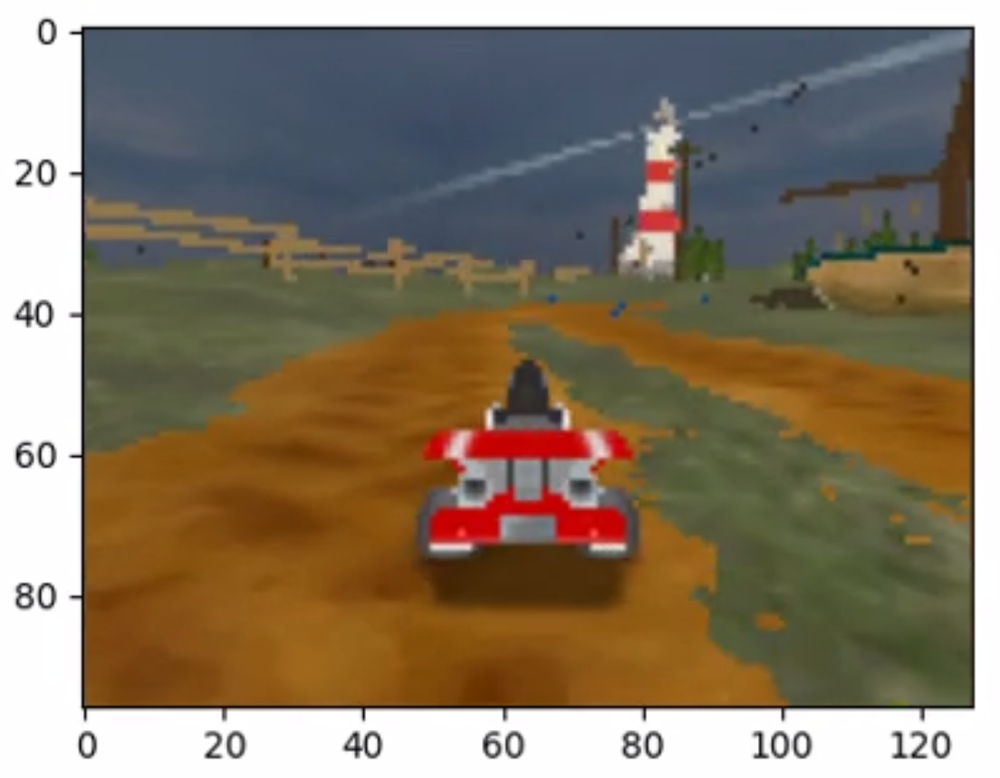

## supertuxkart-steering-generator

`supertuxkart` baseline model predicts `waypoints` to run supertuxkart in the `lighthouse` track. This alternative approach predicts the `steer` function directly from the images to successfully run supertuxkart in `lighthouse` track.

- Installation

```commandline
conda activate py312_supertuxcart

pip install -r requirements.txt

git clone https://github.com/philkr/pystk.git
cd pystk
python setup.py build
python setup.py install
```

- Data Generator

The `Data Generator` uses the `baseline` model which predicts `waypoints` from `images` to generate `50 episodes` of SuperTuxCart run each with `1500 frames`.
Here are the run instructions.

```commandline
mkdir data
cd data_generator
python main.py
```

This generates `50 episodes` of supertuxkart runs. To change this configuration for episode generation, edit `main.py` file.

- Train Model

Train the model with default hyperparameters.
```commandline
lr = 0.001
epochs = 180
batch_size = 128

python train_supertuxcart_cnn.py --model_name=supertuxcart_cnn --train=True
```
This will generate `supertuxcart_cnn.th`.

- Run supertuxkart with this model

Now, run `supertuxkart with steering` predicted from this model.
```commandline
python visualization.py
```
[]
(https://youtu.be/RaqJeXhENHI)

Enjoy!!
